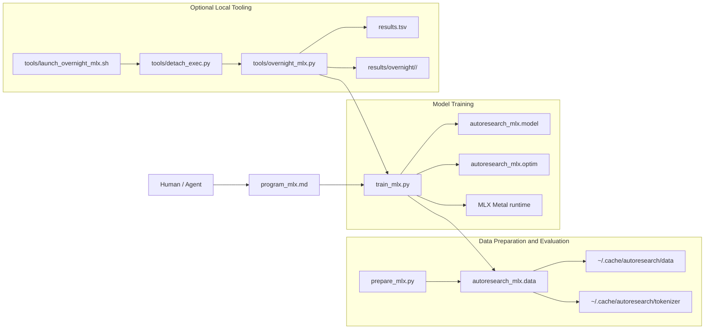
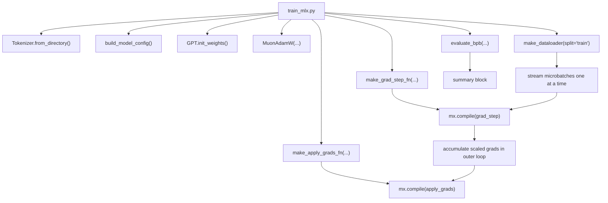
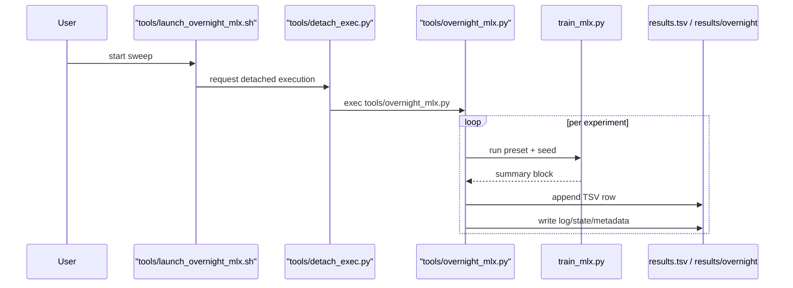

# MLX Port Architecture

## Scope

This document describes the architecture, intent, and current gaps of the MLX path in this fork of [karpathy/autoresearch](https://github.com/karpathy/autoresearch).

It is based on the current repo state, specifically:

- `prepare_mlx.py`
- `train_mlx.py`
- `autoresearch_mlx/constants.py`
- `autoresearch_mlx/data.py`
- `autoresearch_mlx/model.py`
- `autoresearch_mlx/optim.py`
- `program_mlx.md`
- `tools/overnight_mlx.py`
- `tools/launch_overnight_mlx.sh`
- `tools/detach_exec.py`
- the upstream reference path in `prepare.py` and `train.py`

No major architectural unknowns remain after comparing the MLX path against the upstream CUDA path. The main unresolved items are not hidden system relationships; they are explicit feature gaps and caveats listed in the matrix below.

## Executive Summary

The MLX port exists to preserve the upstream autoresearch loop on Apple Silicon:

- keep short, fixed-budget language-model experiments;
- keep the same dataset and tokenizer strategy;
- keep the same model family and optimizer family;
- make the system practical on smaller unified-memory GPUs;
- trade upstream single-file purity for a maintainable, testable package layout.

The MLX port is therefore not a compatibility shim around the CUDA code. It is a parallel implementation of the same research game with three major changes:

1. The backend is Apple-native MLX instead of PyTorch + CUDA + FlashAttention 3.
2. The implementation is split across `autoresearch_mlx/` instead of forcing everything into one mutable file.
3. The runtime is tuned for experiment throughput on M-class Macs, including presets and a small amount of optional workstation automation.

## Architectural Intent

The port is trying to hold two ideas in balance.

### 1. Preserve the upstream research invariant

The upstream repo is built around a very small loop:

- prepare a fixed dataset and tokenizer;
- run a single short training job;
- measure validation BPB;
- decide whether a change was worth keeping.

The MLX port preserves that loop as much as possible. The same data source, tokenizer shape, BOS-packed dataloader idea, GPT family, Muon+AdamW optimizer split, and summary outputs are all retained.

### 2. Make the system native to Apple Silicon

The upstream design assumes a CUDA environment and extremely high throughput. That assumption fails on Apple Silicon in two ways:

- the kernel/runtime APIs are different;
- the practical optimization target changes from maximum instantaneous throughput to maximum useful experiments per night.

The MLX port responds by:

- replacing CUDA-specific runtime code with MLX primitives;
- using MLX arrays and compiled training steps instead of PyTorch CUDA tensors and `torch.compile(model)`;
- introducing M5-oriented presets to keep runs tractable;
- keeping any unattended sweep tooling outside the core training path.

## System Boundaries

The MLX path is easiest to understand as two core subsystems plus one optional local tooling layer:

- data preparation and evaluation;
- model training;
- optional local sweep tooling.

## Subsystem 1: Data Preparation and Evaluation

### Purpose

This subsystem gives the MLX training path a reproducible input corpus and a reproducible evaluation method.

### Components

- `prepare_mlx.py` is a thin CLI wrapper.
- `autoresearch_mlx.constants` defines shared invariants such as `MAX_SEQ_LEN`, `TIME_BUDGET`, `EVAL_TOKENS`, shard locations, tokenizer paths, and vocabulary size.
- `autoresearch_mlx.data` implements the actual data lifecycle.

### Responsibilities

`autoresearch_mlx.data` owns:

- shard download with retries;
- pinned validation shard handling;
- tokenizer training from training shards only;
- pretokenized shard cache generation for reusable training inputs;
- special token layout and BOS token choice;
- token byte lookup generation for BPB evaluation;
- BOS-packed best-fit dataloader generation;
- validation BPB computation.

### Shared invariants with upstream

The following concepts are preserved from `prepare.py`:

- `~/.cache/autoresearch` as the artifact root;
- pinned validation shard (`shard_06542.parquet`);
- `VOCAB_SIZE = 8192`;
- same BPE split pattern;
- same reserved special-token scheme;
- same BOS-packed row construction idea;
- BPB based on token cross-entropy divided by UTF-8 byte count.

### Intentional implementation changes

- Token byte lookups are stored as `token_bytes.npy` instead of PyTorch `token_bytes.pt`.
- Pretokenized shard caches are stored under `~/.cache/autoresearch/token_cache/` as concatenated token streams plus offsets and metadata.
- Prepacked row caches are stored under `~/.cache/autoresearch/prepacked_cache/` and keyed by split plus sequence length. The default `prepare_mlx.py` flow now builds the shipped preset coverage (`256`, `512`, `1024`, `2048`) so prepacked loading is the normal prepared-state fast path rather than an extra opt-in step.
- The MLX dataloader returns `mx.array` batches instead of pinned CPU tensors copied into CUDA buffers.
- Error handling is stricter than upstream for partial data download and missing train shards.

### Dataloader behavior

The loader is not a naive contiguous-token stream. It does all of the following:

- each row has capacity `seq_len + 1`;
- each document is BOS-prefixed before packing;
- documents are packed with a best-fit heuristic to minimize cropping;
- if nothing fits the remaining space, the shortest buffered document is cropped to fill the row exactly;
- inputs are `row[:, :-1]`, targets are `row[:, 1:]`.

This design preserves full token utilization without padding and matches the upstream packing semantics closely.

When a matching prepacked cache exists, the MLX path skips live best-fit packing at runtime and streams prebuilt rows directly. That is now the normal prepared-state path for the shipped presets. When a matching cache does not exist, the loader falls back to the live token-cache path above and prints that fallback explicitly.

## Subsystem 2: Model Training

### Purpose

This subsystem is the actual MLX-native replacement for upstream `train.py`.

### Components

- `train_mlx.py` is the runtime coordinator.
- `autoresearch_mlx.model` defines the GPT family.
- `autoresearch_mlx.optim` defines the Muon+AdamW optimizer implementation.

### Runtime responsibilities in `train_mlx.py`

`train_mlx.py` is responsible for:

- validating that the host is macOS with an MLX Metal GPU;
- loading tokenizer metadata;
- building a `GPTConfig` from the chosen run shape;
- instantiating and initializing the model;
- selecting a preset or applying explicit CLI overrides;
- building the optimizer;
- constructing the train dataloader;
- compiling the training step;
- running a fixed-budget training loop;
- running final validation and printing a summary block.

### Preset system

The MLX path diverges sharply from upstream here. Upstream edits constants in-place. The MLX path exposes a runtime config layer:

- `m5-fast`
- `m5-balanced`
- `m5-large`
- `m5-xlarge`
- `upstream`

This makes the port operable on smaller GPUs without forcing constant source edits just to change batch shape or sequence length.

`m5-xlarge` is the M5-practical version of the upstream-scale architecture: it keeps the `2048`-token, `8`-layer, `512`-wide dense model shape, but pairs it with an M5-sized batch. The `upstream` preset remains the literal reference port, including its original `SSSL` attention pattern and much larger batch shape.

The important calibration detail is that these presets were developed on and tested against an Apple M5 MacBook Pro with 32 GB unified memory and a 10-core GPU. They should be read as machine-specific defaults for that workstation class, not as settled universal defaults for every M5-family machine.

In particular, the preset table is expected to remain somewhat fluid until the port has been profiled on newly released M5 Pro and M5 Max systems.

### Training loop flow

### Model architecture preserved by the port

`autoresearch_mlx.model` retains the same broad model structure as upstream:

- GPT-style decoder stack;
- RMS normalization;
- rotary position embeddings;
- alternating value embeddings (`has_ve`);
- residual interpolation with `resid_lambdas` and `x0_lambdas`;
- sliding-window pattern expressed through `window_pattern`;
- softcapped logits before cross-entropy;
- parameter counting and FLOP estimation helpers.

The port deliberately keeps the math recognizable instead of rewriting the architecture around a more exotic Apple-specific design.

### Attention path

This is the biggest backend-level divergence:

- upstream: direct FlashAttention 3 kernel call through the `kernels` package;
- MLX port: `mx.fast.scaled_dot_product_attention`.

For local-window layers, the MLX port synthesizes an additive mask and caches it per `(seq_len, window_size)` pair.

### Optimizer path

`autoresearch_mlx.optim` mirrors upstream intent, not upstream API shape.

It keeps the same conceptual parameter partitioning:

- `lm_head` via AdamW;
- token embeddings via AdamW;
- value embeddings via AdamW;
- residual scalars via AdamW;
- `x0` scalars via AdamW with a different beta schedule;
- matrix-shaped transformer weights via Muon.

Instead of subclassing `torch.optim.Optimizer`, the MLX version:

- flattens the parameter tree;
- groups paths by role and matrix shape;
- stores optimizer state in explicit MLX arrays;
- applies updates through tree reconstruction back into the model.

This is an idiomatic MLX translation of the upstream optimizer split, not a line-by-line port.

## Optional Local Tooling

### Purpose

This layer makes repeated MLX runs manageable on a local machine without adding a full orchestration service. It is intentionally non-core: the MLX port remains coherent without it.

### Components

- `tools/overnight_mlx.py` performs repeatable, round-robin experiment sweeps.
- `tools/launch_overnight_mlx.sh` starts a detached long-lived run.
- `tools/detach_exec.py` double-forks and redirects logs so the process survives session exit.

### Responsibilities

`tools/overnight_mlx.py` is intentionally simple:

- choose a sweep plan;
- stamp metadata with branch, commit, and timing;
- run `train_mlx.py` as a subprocess for each experiment shape;
- parse the summary block from stdout;
- append a normalized row to `results.tsv`;
- keep per-run logs and state under `results/overnight/<run-tag>/`.

### Controller relationships

### Important meaning of the sweep tooling

This tooling is not yet a full autonomous code-editing research swarm. It does not mutate `train_mlx.py` or open pull requests. It is currently a repeatable benchmarking and search harness over runtime configurations. That makes it operationally useful, but it should be understood as optional workstation automation, not part of the core MLX port.

## Relationships to the Upstream CUDA Path

The upstream code is still present for reference, but the MLX port is not structured the same way.

### Preserved concepts

- same dataset source and shard pinning;
- same tokenizer construction strategy;
- same broad model family;
- same optimizer family;
- same summary output shape;
- same 5-minute training-budget concept.

### Intentional architectural departures

- upstream uses a single mutable `train.py`; the MLX path is split into `data`, `model`, `optim`, and entrypoints;
- upstream bakes hyperparameters into source constants; the MLX path uses presets and CLI overrides;
- upstream is designed around CUDA and direct FA3 kernels; the MLX path is designed around Metal and MLX primitives;
- upstream leaves orchestration to the human/agent loop; this fork keeps that core loop and adds optional sweep tooling under `tools/` for unattended local runs.

These departures are not accidents. They are the core meaning of the fork: portability and maintainability are being prioritized over single-file minimalism.

## Feature Gap Matrix

| Area | Upstream CUDA path | MLX port | Status | Notes |
| --- | --- | --- | --- | --- |
| Data shard download | Parallel download with retries | Same behavior, plus fail-fast if not all shards complete | Improved parity | MLX path is stricter and safer on partial downloads. |
| Tokenizer training | `rustbpe` -> `tiktoken`, token bytes in `torch` tensor | Same tokenizer flow, token bytes in `.npy` | Parity | Serialization differs but semantics match. |
| BOS-packed best-fit dataloader | CUDA-oriented generator with pinned CPU/GPU buffers | Same packing logic with NumPy -> MLX arrays | Near parity | Backend mechanics differ, packing semantics are preserved. |
| Validation BPB formula | Fixed BPB formula, fixed `MAX_SEQ_LEN`, fixed `EVAL_TOKENS` | Same BPB formula | Partial parity | Formula is preserved. |
| Fixed evaluation invariance across configs | Yes | Yes, via canonical `val_bpb` | Near parity | The MLX path now reports a fixed canonical `val_bpb` plus a preset-shaped `proxy_val_bpb` for local inspection. |
| GPT family | RoPE, VE, residual scalars, softcapped logits, sliding windows | Same conceptual architecture | Near parity | Implemented natively in MLX. |
| Attention backend | FlashAttention 3 kernel | `mx.fast.scaled_dot_product_attention` | Intentional divergence | Necessary backend change. Kernel behavior and performance differ. |
| Optimizer family | Custom Muon + AdamW in PyTorch optimizer | Custom Muon + AdamW in MLX tree/state form | Near parity | Parameter grouping intent is preserved. API shape is different. |
| Compile strategy | `torch.compile(model)` plus fused optimizer kernels | `mx.compile(train_step)` over model state + optimizer state | Intentional divergence | Compile boundary is different, but still designed for repeated-step execution. |
| Runtime configurability | Edit constants in source | Presets, CLI overrides, smoke mode | Intentional divergence | Better for local experimentation, less faithful to single-file mutation. |
| Hardware scope | NVIDIA CUDA, FlashAttention-driven | Apple Silicon + Metal via MLX | Intentional divergence | This is the fork's main purpose. |
| Utilization reporting | H100-relative MFU estimate | Measured step compute-share utilization plus estimated training TFLOPs and explicit loader/grad/optimizer/checkpoint/eval breakdowns | Intentional divergence | The MLX path now reports hardware-agnostic utilization telemetry instead of an H100-relative MFU estimate. |
| Overnight experimentation | No in-repo runner | Added local sweep runner and detached launcher | Extension | Useful addition, but not part of upstream parity. |
| Autonomous code mutation | Human/agent edits `train.py` directly | Human/agent edits `train_mlx.py` and/or package modules | Partial parity | The loop exists, but the MLX path is multi-file by design. |
| Resume/checkpoint support | Not present | Step-boundary checkpoint and resume in `train_mlx.py` | Improvement | The MLX path now saves model, optimizer, runtime counters, and train-loader state for resumable local runs, and the end-of-run summary separates current-invocation timing from cumulative progress so resumed reports stay scope-consistent. |

## The Most Important Metric Caveat

The biggest remaining caveat is no longer mixed-shape ranking inside the MLX sweep. That part is fixed by separating canonical `val_bpb` from `proxy_val_bpb`.

The remaining caveat is that the canonical MLX metric is not a byte-for-byte replica of upstream evaluation:

1. The MLX path uses a fixed local canonical context length chosen to be valid across the M5-oriented presets.
2. The upstream repo uses a larger fixed evaluation shape tied to its CUDA/H100 assumptions.

That means the fork now has strong internal comparability across its own sweep shapes, but only approximate comparability to the original upstream leaderboard.

## Why the Port Is Still Architecturally Coherent

Despite that caveat, the port is internally coherent for three reasons:

- The code boundaries are clean. Data, model, optimizer, runtime, and orchestration are separated by responsibility.
- The backend adaptation is honest. The implementation does not pretend to be a tiny patch on top of CUDA assumptions.
- The operational story is complete. There is a real path from setup, to one run, to repeated sweeps, to per-run artifact capture.

In other words, this is already a real system, not a sketch. The main remaining gaps are dataset/pipeline efficiency and operational polish, not missing architecture.

## Recommended Mental Model

The simplest correct way to think about this fork is:

- upstream `autoresearch` is a CUDA-native research toy optimized for one fast GPU and one mutable training file;
- this fork is an MLX-native research workstation port optimized for maintainability and overnight experimentation on Apple Silicon;
- the data plane is mostly preserved;
- the model and optimizer semantics are mostly preserved;
- the runtime and orchestration layers are intentionally redesigned.

That framing matches the actual code organization and the real behavior of the system.
