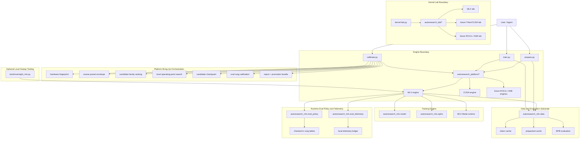

# MLX Platform Architecture

## Scope

This document describes the current platform architecture in autoresearch-everywhere, a fork of [karpathy/autoresearch](https://github.com/karpathy/autoresearch), with MLX as the fully featured primary engine today.

It is centered on the current user story:

- a new user clones the repo on unfamiliar Apple hardware;
- they run one bring-up command;
- the system finds a practical default operating point for that machine;
- the normal autoresearch loop then runs on top of that calibrated default.

So this is no longer just a report about a training script port. It is a report about a small research platform with explicit calibration, runtime policy, and promotion paths.

## Executive Summary

The current platform has seven meaningful subsystems:

1. training-engine boundary and backend adapters
2. platform bring-up orchestration
3. runtime eval policy and telemetry
4. training engine
5. data and evaluation substrate
6. kernel lab boundary and backend workspaces
7. optional local sweep tooling

The architectural center of gravity has moved upward. Early in the port, the main problem was "make autoresearch run on Apple Silicon." The main problem now is "make a new machine discover its own best starting point in a measured, inspectable way."

That shift changed the role of several files:

- `autoresearch_platform/` is now the training-engine boundary where MLX and CUDA meet the same shared contract for train probes, local search, checkpoint minting, eval calibration, runtime capability reporting, and platform bring-up
- `autoresearch_cuda/` now holds safe CUDA defaults and architecture/runtime metadata, including explicit reference-family handling for A100/SM80, Ada RTX 40xx, Ada L40S-class, Hopper/SM90, RTX 50xx-class consumer Blackwell, B200-class Blackwell, a GB10/DGX Spark carve-out, an anticipated Vera Rubin slot, and later ROCm parity
- `calibrate.py` is now the front door for unfamiliar hardware, backed by `tools/calibrate_platform.py`
- `autoresearch_mlx/eval_policy.py` is now runtime policy, not just a static table
- `autoresearch_mlx/eval_telemetry.py` turns ordinary runs into passive calibration evidence
- `autoresearch_mlx/train.py` is both the trainer and the runtime policy consumer

The repo root is intentionally generic now. User-facing entrypoints stay at the top level (`prepare.py`, `train.py`, `calibrate.py`, `program.md`), while engine-specific implementation files live under `autoresearch_*` and supporting materials live under `docs/`, `tools/`, `results/`, and `notebooks/`.

## New User Story

There are now two first-class ways to enter the system.

### Known reference hardware

If the user is effectively on the calibrated M5 reference machine, they can:

1. run `uv sync`
2. run `uv run prepare.py`
3. run `uv run train.py --smoke`
4. start normal experiments

### Unfamiliar hardware

If the user is on a new hardware configuration, the intended path is:

1. run `uv sync`
2. run `uv run prepare.py`
3. run `uv run calibrate.py --mode fast`
4. optionally rerun with `--mode full`
5. review the report and promotion bundle
6. adopt the emitted candidate default for that hardware

That is the new idealized bring-up loop. The rest of the architecture exists to support it.

## System Map

## Subsystem 1: Training-Engine Boundary

### Purpose

This subsystem exists so backend inclusion happens once at a shared contract, not by duplicating top-level workflows. Platform bring-up is the first major consumer, but the boundary is intentionally broader than that.

### Main files

- `autoresearch_platform/engines.py`
- `autoresearch_platform/mlx_engine.py`
- `autoresearch_platform/cuda_engine.py`
- `autoresearch_cuda/`

### Responsibilities

The shared engine contract now owns or prepares to own:

- hardware fingerprinting
- preset catalogs and default engine presets
- comparable train probes
- local-search axes
- checkpoint minting
- eval calibration
- runtime capability and architecture reporting

That means new engines should be added by implementing this contract first, then teaching the rest of the stack to consume their capabilities, rather than by creating new top-level orchestration trees.

### Current state

- MLX is the first fully featured engine on this boundary.
- CUDA is the first secondary engine on the same boundary and already goes beyond upstream's original path in structure, dispatch, and runtime policy, even though MLX remains the deeper end-to-end implementation.
- ROCm and ANE should be added as new training engines on the same boundary.

## Subsystem 2: Platform Bring-Up Orchestration

### Purpose

This subsystem exists so a user on new hardware does not need to understand the internal calibration primitives before they can get to a good starting point. It is also the intended revalidation path after meaningful autoresearch changes that may alter the best operating point on the same hardware.

### Main file

- `calibrate.py`

### Responsibilities

It currently does all of the following:

- detect the hardware fingerprint
- run a coarse envelope across shipped preset families
- run short comparable ranking probes
- choose a candidate family
- run a local search inside that family
- mint a candidate checkpoint
- calibrate eval rungs on that checkpoint
- emit:
  - a Markdown report
  - a JSON artifact
  - a promotion bundle

### Current selection logic

Candidate family selection is now:

1. primary frontier on:
   - short-run validation quality
   - steady-state throughput
   - eval overhead
2. pressure-aware memory shaping:
   - below `50%` of unified memory, memory contributes only a small tie-break cost
   - above `50%`, memory pressure progressively shapes the decision
   - near capacity, memory becomes a real penalty
3. telemetry maturity as a tie-break and confidence signal

This is important. The selector no longer treats memory as a fully co-equal objective at all times, but it also does not ignore memory below `50%`. It keeps a small comfort cost there so obviously leaner shapes still win ties.

### What it affords

For users:

- a one-command hardware bring-up path
- a candidate default instead of a bag of raw measurements
- explicit `lower`, `recommended`, `upper`, and `reference` zones

For automation:

- resumable phase artifacts
- machine-readable promotion outputs
- a stable structure for later fleet-style hardware bring-up

## Subsystem 3: Runtime Eval Policy and Telemetry

### Purpose

This subsystem prevents the runtime from silently over-trusting thin calibration.

### Main files

- `autoresearch_mlx/eval_policy.py`
- `autoresearch_mlx/eval_telemetry.py`
- policy consumption inside `autoresearch_mlx/train.py`

### Responsibilities

The policy layer now does more than store rung timings. It also tracks:

- hardware-key exactness
- preset-shape coverage
- policy-version compatibility
- calibration freshness
- effective confidence
- stable-rung coverage
- telemetry count, commit spread, and day spread
- eval-semantics signature
- runtime-shape signature

Those signatures are meant to be conservative guardrails, not the full revalidation policy. The preferred control path is still agent judgment: when a change looks likely to alter the best operating point across shapes or hardware, the agent should proactively rerun platform calibration instead of waiting for a signature mismatch.

The runtime then decides whether it may:

- use a checked-in `cheap` rung
- use `reference`
- use `full`
- or must fall back visibly to the default canonical settings

### Why this matters

Without this layer, the system would drift semantically as soon as:

- the hardware changed
- the preset shape drifted
- the evaluator changed
- the model or runtime changed in a way that invalidates old scaling assumptions
- calibration got old

That is exactly the failure mode the new platform story needs to avoid. Static signatures help, but the broader protection comes from combining them with disciplined agent-triggered revalidation after meaningful findings.

### Current canonical eval model

The canonical MLX metric is now an upstream-oriented long-context ladder rather than a single cheap fixed local metric:

- `cheap`
- `reference`
- `full`

The default canonical context length is `2048`.

For reduced-budget rungs, the eval path uses evenly spaced slices across the first upstream-sized horizon. For the full rung, it stays sequential, because full sliced and full sequential were measured to agree numerically while sequential was faster.

This is the key reason the runtime can now auto-pick different canonical fidelity levels for `5m` versus `8h` runs.

## Subsystem 4: Training Engine

### Purpose

This is the MLX-native replacement for upstream `train.py`.

### Main files

- `autoresearch_mlx/train.py`
- `autoresearch_mlx/model.py`
- `autoresearch_mlx/optim.py`

### Responsibilities

The training engine is responsible for:

- turning presets and CLI overrides into a concrete run shape
- instantiating the GPT family
- compiling the grad and apply steps
- running fixed-budget training
- exposing runtime telemetry
- consuming runtime eval policy
- checkpointing and resuming

### Important evolution

The trainer is no longer just "the thing that trains." It is now also the place where calibrated runtime policy becomes live behavior.

That means a summary from `autoresearch_mlx/train.py` now carries much more than loss and throughput. It can also say:

- which canonical eval rung was chosen
- why it was allowed
- whether it was limited by confidence
- whether the hardware matched calibration exactly

That is a meaningful architectural change from the earlier MLX port.

## Subsystem 5: Data and Evaluation Substrate

### Purpose

This subsystem keeps the training and calibration paths reproducible.

### Main files

- `autoresearch_mlx/prepare.py`
- `autoresearch_mlx/data.py`
- `autoresearch_mlx/constants.py`

### Responsibilities

It owns:

- shard download
- tokenizer training
- token-byte lookup generation
- shard token caches
- prepacked row caches
- BOS-packed live fallback loading
- BPB evaluation mechanics

### Current role in the platform story

This layer used to look like a pure backend translation concern. It now matters directly to platform bring-up because:

- the bring-up tool depends on repeatable quick probes
- eval ladders depend on cheap and stable val access
- prepacked caches are the normal prepared-state fast path for shipped presets

So the data plane is now part of the calibration substrate, not just a prerequisite for training.

## Subsystem 6: Kernel Lab Boundary and Backend Workspaces

### Purpose

This layer is the experimental sibling of the training-engine boundary. It exists so backend-specific kernel work can share one outer workflow without forcing all backends into one kernel API.

### Main files

- `kernel-lab.py`
- `autoresearch_lab/`
- `autoresearch_mlx/lab.py`
- `autoresearch_mlx/lab_profile.py`
- `autoresearch_mlx/lab_trace.py`
- `autoresearch_mlx/lab_workspace.py`
- `docs/kernel-lab.md`

### Current role in the platform story

The lab is intentionally narrower than the training path:

- the top level owns the generic `kernel-lab.py` front door
- `autoresearch_lab/` owns the shared boundary and backend registry
- each backend owns its own mutable workspace and fixed benchmark harness

The current implementation is MLX-first and starter-target-first:

- starter-ready workspaces:
  - `rmsnorm`
  - `layernorm`
  - `rmsnorm_backward`
  - `layernorm_backward`
  - `residual_blend`
  - `residual_rmsnorm`
  - `qk_rmsnorm`
  - `rope_qk_fused`
  - `logits_softcap`
  - `activation_pointwise`
  - `rotary_embedding`
  - `reduce`
  - `softmax`
  - `value_embed_gate`
  - `ve_lookup_reshape`
  - `attention_mask_local`
  - `proj_head_reshape`
  - `loss_logits_cast_softcap`
  - `cross_entropy_prelude`
  - `cross_entropy_full`
  - `attention_prelude`
  - `block_prelude`
  - `fused_mlp`
- `flash_attention` is explicitly deferred as a first MLX lab target

The first shared outer loop is now present too:

- `profile` ranks likely MLX targets for a preset using model-aware heuristics
- `extract` instantiates a mutable workspace from a saved profile artifact
- `orchestrate` emits the next ready command sequence for a selected ranked target
- `verify` reruns the fixed harness as the promotion gate above a quick bench
- `capture` writes a real `.gputrace` and sidecar metadata artifact for a workspace run

The important distinction is that the lab now has two evidence layers:

- heuristic layer:
  - `profile`
  - `extract`
  - `orchestrate`
  - `bench`
  - `verify`
  - cheap, fast, and good for choosing work
- trace layer:
  - `capture`
  - Xcode Metal Debugger / Metal System Trace after opening the artifact
  - slower, but the truth source for Apple Silicon performance claims

So the lab is no longer just "one mutable file plus a microbench." It is now a split system where heuristics select candidates and trace artifacts validate whether a candidate matters in the real backend.

The long-term reason this matters now is not that MLX kernel work is already broad. It is that the repo now has a place where future Triton/CUDA, ROCm, and ANE labs can plug into the same outer workflow instead of growing separate kernel-optimization trees.

## Subsystem 7: Optional Local Sweep Tooling

### Purpose

This layer is still optional. It is useful for unattended workstation sweeps, but it is not the main architectural story anymore.

### Main files

- `tools/overnight_mlx.py`
- `tools/launch_overnight_mlx.sh`
- `tools/detach_exec.py`

### Current place in the system

This tooling now sits below platform bring-up in importance:

- bring-up finds the right initial default for a machine
- the runtime policy keeps normal runs honest
- overnight tooling helps exploit that calibrated default over time

That is a healthier ordering than the earlier design, where the overnight tooling risked looking like the center of the MLX story.

## Relationship to Upstream

### Preserved

- same broad dataset and tokenizer strategy
- same GPT-family research toy
- same 5-minute default training budget concept
- same "edit, run, compare validation BPB" loop

### Intentionally changed

- upstream single-file mutation became a multi-module MLX runtime
- fixed CUDA-shaped eval became a rung-based long-context policy
- no-calibration setup became explicit platform bring-up
- human/agent memory about the machine became checked-in policy plus passive telemetry

That means autoresearch-everywhere is no longer best described as "upstream, but on MLX." It is better described as:

- an MLX-native autoresearch platform
- with Apple-Silicon bring-up and runtime calibration as first-class concerns

## Feature Matrix

| Area | Upstream CUDA path | Current MLX path | Meaning |
| --- | --- | --- | --- |
| Training entry | Single mutable `train.py` | `autoresearch_mlx/train.py` plus MLX modules | Maintainability over single-file purity |
| Hardware assumption | Fast NVIDIA GPU | Calibrated Apple Silicon workstation classes | Local hardware fit is explicit |
| Eval policy | One heavy fixed final eval | `cheap/reference/full` rung ladder with confidence gates | Eval fidelity now scales with budget and trust |
| Runtime trust model | Implicit | Hardware key, freshness, confidence, telemetry | Semantic drift is surfaced instead of hidden |
| New-machine onboarding | Human decides what to try | `calibrate.py` finds a candidate default | Bring-up is part of the product |
| Promotion path | Human copies ideas manually | Promotion bundle emitted automatically | Measurement now points at adoption |
| Long unattended sweeps | External/manual | Optional `tools/` local sweep layer | Useful, but no longer central |

## Main Caveats

The architecture is much more coherent than before, but there are still important limits.

### 1. The bring-up selector is only as good as the explored candidate set

The new selector is more defensible, but it still only ranks the families and local-search points it actually measured.

### 2. Promotion is still review-oriented

The bring-up tool emits promotion artifacts by default, but it does not automatically rewrite checked-in preset tables or policy rows.

### 3. Confidence aggregation is improving, not finished

Passive telemetry now feeds runtime trust, but the strongest policy promotion still comes from explicit calibration runs, especially for `full`.

## Recommended Mental Model

The simplest correct way to think about the current repo is:

- `autoresearch_mlx/prepare.py` makes the data plane reproducible
- `autoresearch_mlx/train.py` runs the research loop
- `eval_policy.py` decides how much evaluation fidelity the runtime is allowed to trust
- `eval_telemetry.py` lets ordinary runs strengthen or age that trust
- `calibrate.py` is the one-button path that turns an unfamiliar machine into a measured default for the rest of the system
- `kernel-lab.py` is the top-level experimental front door for backend-specific kernel work under a shared outer workflow

That is the current architecture. The port is no longer just an MLX training path. It is an MLX research platform with explicit machine bring-up.
