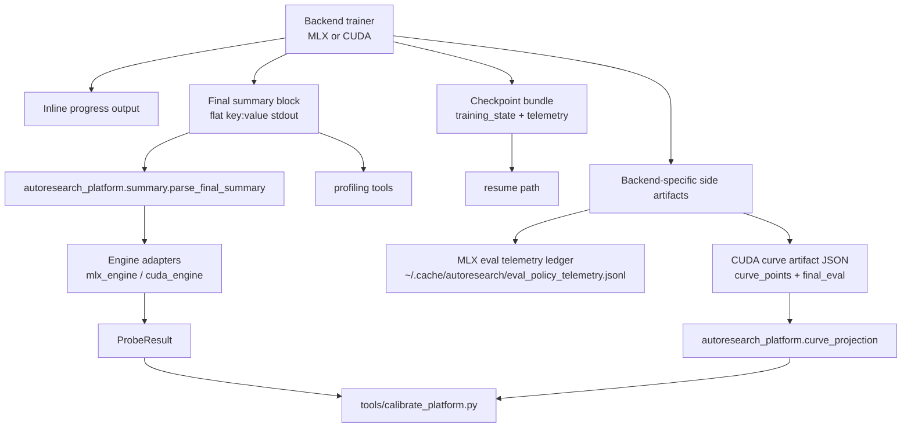

# Telemetry Architecture Primer

This document is the current primer and reference for `autoresearch-everywhere` telemetry as of March 15, 2026.

It covers:

- what telemetry exists today
- why each telemetry stream exists
- where each stream is emitted, stored, and consumed
- the semantic differences between MLX and CUDA
- the current cross-backend gaps
- a glossary of the important terms

The intended audience is anyone touching:

- `autoresearch_mlx/train.py`
- `autoresearch_cuda/train.py`
- `autoresearch_platform/*`
- `tools/calibrate_platform.py`
- the checkpoint / eval / curve tooling

## Why The System Exists

Telemetry in this repo is not just observability for humans. It is also policy input.

The current telemetry stack supports four jobs:

1. explain what a training run actually did
2. preserve enough state to resume safely
3. let calibration tools compare presets and batch shapes using shared fields
4. let longer-horizon projection tools reason from partial curves instead of only one final snapshot

That makes the telemetry surface part of the training-engine contract, not a cosmetic reporting layer.

## Architecture Map

## Telemetry Layers

### 1. Inline Progress Telemetry

Both trainers emit an inline progress line during training.

Purpose:

- reassure the user that the run is alive
- expose coarse progress, loss, throughput, and utilization
- make obvious failures visible early

Shared ideas:

- `step`
- budget progress
- current loss
- `tok/sec`
- one utilization-ish number

Important difference:

- MLX progress prints `util` as compute-share-of-step-time and `tflops`
- CUDA progress prints `util` as compute-share-of-step-time and `mfu` as peak-FLOPS utilization

So even the live progress line is not semantically identical across backends.

### 2. Final Summary Telemetry

Both trainers end with a flat `key: value` summary block after a `---` marker.

Current shared parser:

- `autoresearch_platform/summary.py`

Current main consumers:

- `autoresearch_platform/mlx_engine.py`
- `autoresearch_platform/cuda_engine.py`
- `tools/profile_cuda_checkpoint_overhead.py`
- `tools/profile_cuda_resume_convergence.py`

Purpose:

- define the machine-readable contract for probe runs
- provide calibration input without importing backend code directly
- support post-hoc tooling from captured stdout alone

Important current limitation:

- the parse side is shared
- the emit side is still duplicated in `autoresearch_mlx/train.py` and `autoresearch_cuda/train.py`

That means summary parsing is unified, but summary writing can still drift.

### 3. Per-Step Timing Telemetry

Shared implementation:

- `autoresearch_platform/step_telemetry.py`

Core objects:

- `StepTiming`
- `StepTelemetry`
- `StepTelemetrySummary`

Purpose:

- track per-step timing at a backend-neutral semantic level
- preserve totals across resume
- derive normalized summary metrics like `compute_share_percent` and `train_tflops`

The key design split is:

- additive phases
- overlapping observations

That split is critical.

### 4. Checkpoint Telemetry

Shared policy surface:

- `autoresearch_platform/checkpoint_policy.py`

Shared async writer:

- `autoresearch_platform/async_checkpoint.py`

Backend checkpoint implementations:

- `autoresearch_mlx/checkpoints.py`
- `autoresearch_cuda/checkpoints.py`

Purpose:

- decide when to checkpoint
- report what checkpointing cost
- preserve telemetry across resume
- distinguish blocking save cost from total background write cost

The training summary currently exposes:

- `checkpoint_percent`
- `checkpoint_write_percent`
- `checkpoint_count`
- `cumulative_checkpoint_seconds`
- `cumulative_checkpoint_write_seconds`
- `cumulative_checkpoint_count`

### 5. Eval Policy Telemetry

MLX has a persistent eval telemetry ledger:

- `autoresearch_mlx/eval_telemetry.py`
- on disk at `~/.cache/autoresearch/eval_policy_telemetry.jsonl`

CUDA currently does not have an equivalent passive ledger.

CUDA instead uses checked-in eval calibration rows in:

- `autoresearch_cuda/eval_policy.py`

Purpose:

- decide which canonical rung to use
- track freshness and confidence
- encode whether auto-selected eval settings are actually trustworthy

This is one of the biggest current cross-backend differences.

### 6. Curve / Projection Telemetry

CUDA can emit curve artifacts:

- `autoresearch_cuda/train.py`
- optional `--curve-output`

Shared consumers:

- `autoresearch_platform/curve_projection.py`
- `tools/curve_report.py`
- `tools/calibrate_platform.py`

Purpose:

- capture intermediate validation points
- project beyond the observed horizon
- compare candidate presets at a target horizon or token budget

MLX does not currently emit matching curve artifacts.

## Additive Phases vs Overlapping Observations

This is the most important subtlety in the current design.

### Additive Phases

Additive phases are intended to partition wall-clock step time.

Examples:

- MLX:
  - `loader`
  - `grad`
  - `accumulate`
  - `optimizer`
- CUDA:
  - `forward_backward`
  - `optimizer`

Properties:

- they contribute to `phase_*_percent`
- they should sum to at most `total_seconds`
- `other_step_percent` is computed as the residual after additive phases only

### Overlapping Observations

Overlapping observations are real costs, but they do not claim to partition wall time.

Current shared example:

- `input_pipeline_percent`

Why this exists:

- on MLX, loader work is a normal additive phase
- on CUDA, host-side `next(train_loader)` work happens while GPU work is already in flight and can overlap queued compute and nonblocking H2D copy

If CUDA reported that host time as an additive `loader_percent`, the phase percentages would become misleading. So the shared surface now distinguishes:

- additive phase timing
- overlapping observed work

Practical rule:

- use `phase_*_percent` for wall-time partitioning
- use `input_pipeline_percent` for “how much host-side batch staging are we doing?” across both backends

Do not add `input_pipeline_percent` into `other_step_percent`, `compute_share_percent`, or any control-overhead total.

## Shared Semantics

### Step Telemetry State

`StepTelemetry` stores both:

- cumulative totals across all steps
- a smaller “steady” window selected by the trainer

This state is also persisted in checkpoints, so resumed runs keep telemetry continuity.

Backward compatibility:

- `StepTelemetry.from_dict(...)` still restores the older MLX flat payload format

### Compute Share

`compute_share_percent` is shared, but it is backend-defined through `compute_phases`.

Current definitions:

- MLX compute phases:
  - `grad`
  - `accumulate`
  - `optimizer`
- CUDA compute phases:
  - `forward_backward`
  - `optimizer`

So the name is shared, but the exact bucket contents differ.

### Train TFLOPS

`train_tflops` is shared and derived from:

- estimated FLOPs per token
- total batch size
- average step time over the selected window

This is a backend-neutral throughput-style metric.

### Other Step Percent

`other_step_percent` is the wall-time residual:

- `total_step_seconds - sum(additive phase seconds)`

It is not:

- residual after overlapping observations
- scheduler/host-only time specifically
- a precise “framework overhead” bucket

It is just whatever additive phases do not account for.

## Backend Semantics Today

### MLX

MLX currently exposes the richest additive step partition:

- `loader_percent`
- `grad_percent`
- `accum_percent`
- `optimizer_percent`

It also emits:

- `input_pipeline_percent`
- `compute_share_percent`
- `train_tflops`
- `other_step_percent`

Important alias:

- `mfu_percent` on MLX is currently just a legacy alias for `compute_share_percent`
- it is not a hardware-peak FLOPS utilization metric

MLX also has the richer eval telemetry story:

- passive eval telemetry ledger
- freshness / commit-count / day-count / stable-rung coverage

### CUDA

CUDA currently exposes:

- `forward_backward_percent`
- `optimizer_percent`
- `input_pipeline_percent`
- `compute_share_percent`
- `train_tflops`
- `other_step_percent`

Important alias:

- `mfu_percent` on CUDA is currently peak-FLOPS utilization style telemetry
- it is also emitted as `peak_flop_utilization_percent`

Important caveat:

- the current CUDA peak-FLOPS metric is still anchored on the `H100_BF16_PEAK_FLOPS` constant in `autoresearch_cuda/train.py`
- on GB10 and other non-H100 hardware, that makes it a rough legacy proxy, not a fully hardware-correct utilization metric

CUDA also has the richer curve story:

- curve artifacts
- truth-matched projection
- multi-horizon comparison
- longer-horizon candidate selection

But CUDA does not yet have MLX’s passive eval telemetry ledger.

## Window Semantics

Window semantics are another subtle area.

### MLX

MLX currently has two different ideas of “steady state”:

1. `StepTelemetry` steady window:
   - starts after `UTILIZATION_WARMUP_STEPS`
   - currently a simple fixed early-step exclusion

2. benchmark steady-state throughput window:
   - determined later by `detect_benchmark_warmup_steps(...)`
   - used for `steady_state_tokens_M`, `steady_state_steps`, and `steady_state_tok_per_sec`

So on MLX:

- `util_window` is not necessarily identical to the throughput steady-state window

### CUDA

CUDA currently uses one main steady-state gate for the step telemetry and throughput-style metrics:

- steps after `timing_count_starts_after_step`

That makes CUDA steadiness simpler, but also less adaptive than MLX.

## How The Telemetry Flows Into Policy

### Calibration

`tools/calibrate_platform.py` consumes `ProbeResult` rows from the engine adapters.

It uses, among other things:

- `val_bpb`
- `steady_state_tok_per_sec`
- `peak_vram_mb`
- `eval_percent`
- `control_overhead_percent`
- curve artifacts when available

Important current asymmetry:

- MLX exposes `control_overhead_percent` as `accum_percent + optimizer_percent`
- CUDA does not currently expose a matching `control_overhead_percent`
- so CUDA calibration cannot yet use that signal symmetrically

### Eval Policy

MLX uses passive telemetry to decide whether a checked-in policy row is still trustworthy.

CUDA uses a smaller checked-in calibration table and runtime signatures, but not a live telemetry ledger.

### Curve Projection

CUDA curve artifacts feed:

- target-horizon ranking
- token-budget comparison
- truth-match projection
- calibrated projection
- multi-horizon stability checks
- longer-horizon crossover summaries

That stream is currently absent on MLX.

### Checkpoint Policy

Both backends now use the shared checkpoint policy surface.

The chooser depends on calibrated checkpoint cost rows:

- MLX: historical calibrated rows, including exact sync and exact async
- CUDA: GB10-grounded exact sync and exact async rows

The first automatic checkpoint is intentionally delayed until elapsed training time is strictly `>300s`, so the default `300s` bring-up path stays overhead-free unless the user explicitly asks otherwise.

## Current Gaps Matrix

| Area | MLX | CUDA | Current state / note |
| --- | --- | --- | --- |
| Final summary parser | Shared consumer | Shared consumer | `autoresearch_platform.summary.parse_final_summary` is shared. |
| Final summary emitter | Local | Local | Still duplicated; this is a real drift risk. |
| Shared step-telemetry datamodel | Yes | Yes | `StepTiming` / `StepTelemetry` are shared. |
| Additive `loader_percent` | Yes | No | CUDA intentionally does not treat host input work as an additive wall-time phase. |
| Additive `grad_percent` | Yes | No | CUDA collapses this into `forward_backward_percent`. |
| Additive `accum_percent` | Yes | No | CUDA does not emit a distinct accumulation phase. |
| Additive `forward_backward_percent` | No | Yes | CUDA-specific wall-time phase. |
| Shared `input_pipeline_percent` | Yes | Yes | Same field, different semantics: additive-equivalent on MLX, overlapping observation on CUDA. |
| Shared `compute_share_percent` | Yes | Yes | Shared name, backend-specific compute-phase definitions. |
| Shared `train_tflops` | Yes | Yes | Shared derived metric. |
| Shared `other_step_percent` | Yes | Yes | Shared residual after additive phases only. |
| `mfu_percent` semantics | Legacy compute-share alias | Peak-FLOPS-style metric | Not comparable across backends; treat as legacy name only. |
| `peak_flop_utilization_percent` | No | Yes | CUDA-only today, and still anchored to an H100 constant. |
| `control_overhead_percent` consumer signal | Yes | No | Derived only on MLX today; CUDA engine does not provide it. |
| Passive eval telemetry ledger | Yes | No | MLX writes `~/.cache/autoresearch/eval_policy_telemetry.jsonl`; CUDA does not. |
| Checked-in eval calibration rows | Yes | Yes | Both have checked-in policy rows, but MLX also has live telemetry evidence. |
| Curve artifact emission | No | Yes | CUDA supports `--curve-output`; MLX currently does not. |
| Truth-matched projection | No | Yes | Lives in shared projection code, but only CUDA feeds it today. |
| Proxy-vs-canonical eval summary | Yes | Partial | MLX prints both `val_bpb` and `proxy_val_bpb`; CUDA currently reports only final eval BPB in the summary. |
| Final loss telemetry in summary | No | Yes | CUDA prints `last_train_loss` and `smoothed_train_loss`; MLX currently does not. |
| Warmup detector for throughput summary | Yes | No | MLX has auto/fixed benchmark warmup detection; CUDA uses a fixed telemetry gate. |
| Shared async exact checkpoint writer | Yes | Yes | Shared orchestration exists in `autoresearch_platform.async_checkpoint`. |
| Auto checkpoint planner grounded in measured save cost | Yes | Yes | Shared chooser, backend-specific calibration rows. |
| Resume-ready penalty calibration | Yes | Partial | MLX has calibrated resume-ready penalty; CUDA rows still use `0.0` pending real profiling. |
| Approximate `weights_only` checkpoint mode | Legacy support remains | No | Current direction is exact-only; MLX still retains legacy support for comparison. |

## What To Be Careful About

### 1. Do Not Compare `mfu_percent` Across Backends

Today:

- MLX `mfu_percent` == compute share alias
- CUDA `mfu_percent` == peak-FLOPS-style utilization

Those are not the same metric.

### 2. Do Not Treat `input_pipeline_percent` As An Additive Phase

Especially on CUDA, it is intentionally an overlapping observation.

### 3. Do Not Assume `util_window` Means The Same Thing As Throughput Steady State

That is currently false on MLX.

### 4. Do Not Assume Every `ProbeResult` Field Is Equally Meaningful On Both Backends

The shared dataclass is broader than the currently symmetric subset.

### 5. Do Not Assume CUDA’s Peak-FLOPS Utilization Is Hardware-Accurate Yet

The current implementation still uses an H100-named peak constant.

## Recommended Direction

The current telemetry architecture is moving in the right direction. The highest-value follow-ups are:

1. share the final-summary emitter, not just the parser
2. either add a true CUDA control-overhead aggregate or stop pretending it is comparable in calibration
3. make CUDA peak-FLOPS utilization use hardware-correct peak tables instead of the H100 constant
4. decide whether MLX should emit curve artifacts too
5. decide whether CUDA should gain a passive eval telemetry ledger like MLX

## Glossary

### additive phase

A timing bucket that is intended to partition step wall time. Additive phases contribute to `phase_*_percent` and are used to compute `other_step_percent`.

### calibration

Measured evidence used to drive automatic policy choices instead of hard-coded defaults.

### canonical rung

The selected eval rung for a run, typically one of `cheap`, `reference`, or `full`.

### checkpoint percent

Blocking checkpoint time during the current run as a percentage of total run wall time.

### checkpoint write percent

Total checkpoint write cost as a percentage of total run wall time. In async mode this can exceed the blocking checkpoint percent because background write time is counted separately.

### compute share percent

The percentage of step wall time attributed to backend-defined compute phases. It is shared in name, but not identical in internal bucket composition across MLX and CUDA.

### control overhead percent

A calibration-facing aggregate currently derived only on MLX as `optimizer_percent + accum_percent`. CUDA does not yet emit a symmetric value.

### curve artifact

A JSON record of intermediate validation points plus a final evaluation summary, currently emitted by CUDA runs with `--curve-output`.

### eval telemetry ledger

The append-only MLX JSONL file of eligible canonical eval observations used to assess freshness, stability, and repeat coverage.

### forward backward percent

CUDA additive phase for the combined forward and backward GPU work.

### grad percent

MLX additive phase for compiled gradient computation.

### input pipeline percent

Shared overlapping observation for host-side batch staging work. On MLX it matches loader work closely; on CUDA it records host time spent advancing the loader while GPU work may still be in flight.

### loader percent

MLX additive phase for fetching the next batch. There is intentionally no direct additive CUDA analogue today.

### mfu percent

Legacy field name with backend-specific meaning. On MLX it is currently an alias for `compute_share_percent`. On CUDA it is peak-FLOPS-style utilization and should be treated as backend-local.

### observed target

In curve projection, a target horizon that has already been directly observed rather than extrapolated.

### other step percent

Residual wall-time percentage after subtracting additive phases from total step time.

### peak flop utilization percent

CUDA-only field for peak-FLOPS-style utilization. More semantically precise than CUDA’s legacy `mfu_percent`, but currently based on a stale H100 constant.

### phase percent

An additive phase’s share of step wall time, emitted as `phase_*_percent`.

### projection source

How a projected result was formed, for example:

- `observed-target`
- `truth-match`
- `calibrated-extrapolation`
- `calibrated-projection`
- `generic-projection`

### proxy val_bpb

The cheaper validation BPB used on MLX before the canonical eval. CUDA does not currently emit an analogous final-summary field.

### steady state

The subset of training steps intended to exclude warmup effects. The exact definition is backend-specific today.

### step telemetry

The shared in-memory and checkpoint-persisted record of per-step wall time, additive phase time, and overlapping observations.

### train TFLOPS

Estimated training teraFLOPS per second over the selected summary window, derived from estimated FLOPs per token and average step time.

### truth match

Projection mode where a partial curve is corrected against matching completed truth curves for the same preset / engine / hardware bucket.

### util window

The summary window used for step-telemetry aggregation. It is shared in name, but not identical to all throughput warmup calculations.

### winner probability

In projection tooling, the Monte Carlo-estimated probability that a candidate is the best at the target horizon.
